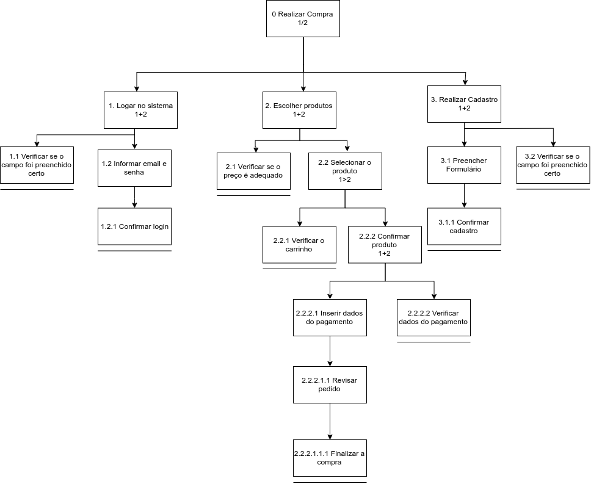
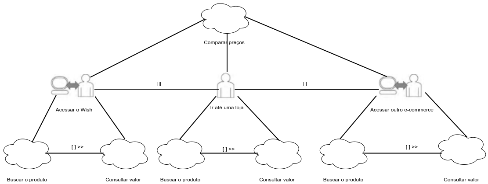

# Análise de Tarefas

## Introdução

A análise de tarefas tem por objetivo, compreender sobre o trabalho dos usuários, como realizam esse trabalho e por quê realizam. Ela pode ser utilizada em diferentes momentos no desenvolvimento de um software: para a análise da situação atual (apoiada ou não por um sistema computacional), para o (re)design de um sistema computacional ou para a avaliação do resultado de uma intervenção que inclua a introdução de um (novo) sistema computacional [1].

As análises de tarefas devem envolver um processo de coleta de dados responsáveis por definir objetivos dos usuários dentro da plataforma. No livro Interação Humano-Computador de Simone Diniz e Bruno Siqueira, é apresentado três dos métodos mais comuns de análise de tarefas: O Análise Hierárquica de Tarefas (HTA), GOMS e o ConcurTaskTrees.

No presente projeto, utilizaremos o HTA e o ConcurTaskTrees.

## Análise Hierárquica de Tarefas (HTA)

A Análise Hierárquica de Tarefas analisa os objetivos de alto nível e os decompõe em subobjetivos. Cada subojetivo é alcançado por uma operação, que é a unidade fundamental do HTA.

No site do Wish analisaremos o objetivo de realização de uma compra.

### Diagrama HTA para Realizar uma Compra

### Representação de Tarefas para o Objetivo Realizar uma Compra

|Objetivo/Operações|Problemas e Recomendações|
|-|-|
|0. Realizar Compra 1/2|plano: realizar login ou cadastro e depois escolher o produto da loja|
|1. Logar no sistema 1+2|ação: informar tipo de login recomendação1: email e senha recomendação2: facebook  recomendação3: Google|
|1.1 Verificar se o campo foi preenchido corretamente||
|1.2 Informar email e senha|plano: informar email e senha|
|1.2.1 Confirmar Login|ação: apertar o botão de login|
|2. Escolher Produto 1+2|problema: O produto pesquisado nem sempre é exibido|
|2.1 Verificar se o preço é adequado||
|2.2 Selecionar o produto 1>2|problema: O produto selecionado exibe um preço confuso|
|2.2.1 Verificar o carrinho||
|2.2.2 Confirmar produto 1+2|ação: apertar o botão de finalizar|
|2.2.2.1 Inserir dados do pagamento|ação: informar tipo de pagamento plano1: número do cartão de crédito, código de segurança, cpf, email, validade  plano2: logar no paypal   plano3: informar nome e email |
|2.2.2.1.1 Revisar Pedido||
|2.2.2.1.1.1 Finalizar a compra|ação: apertar o botão comprar|
|2.2.2.2 Verificar dados do pagamento||
|3. Realizar cadastro 1+2|ação: informar tipo de cadastro recomendação1: email e senha recomendação2: facebook  recomendação3: Google|
|3.1 Preencher formulário|plano: informar nome, sobrenome, email e senha|
|3.1.1 Confirmar cadastro|ação: apertar o botão de cadastrar|
|3.2 Verificar se o campo foi preenchido corretamente||

## ConcurTaskTree (CTT)

O modelo da ConcurTaskTree foi criado com o objetivo de auxiliar na avaliação de IHC. É um modelo que combina estruturas hierárquica de tarefas
concorrentes com um conjunto de operadores temporais. [2]

A vantagem dentro do CTT é a possibilidade de registrar as relações entre as tarefas de forma mais clara.

Logo abaixo, foi realizado a análise de Consulta de um Valor de Produto, como objetivo do usuário.

## Referências
[1] Barbosa, S. D. J.; Silva, B. S. Interação Humano-Computador. Rio de Janeiro: Elsevier, 2010.
[2] https://www.maxwell.vrac.puc-rio.br/18627/18627_5.PDF