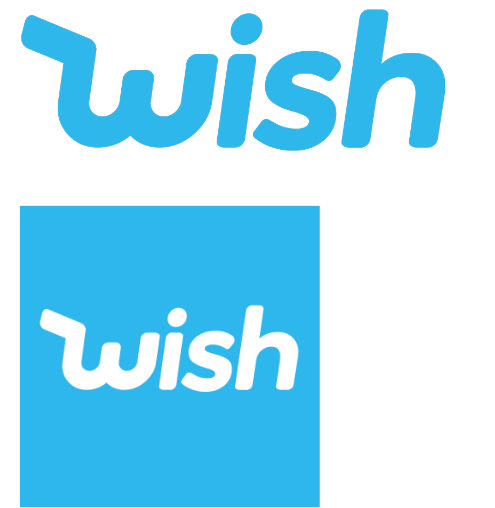
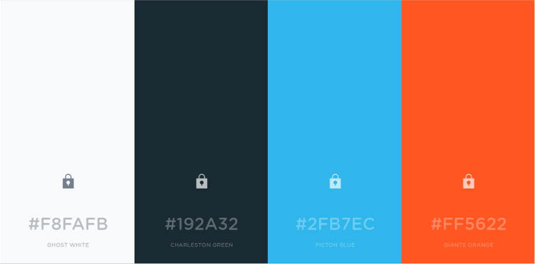
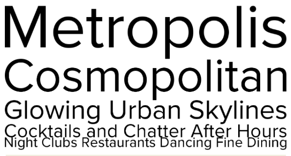

## Logo

A logo na sua variação escrita por extenso pode ser utilizada com o azul em fundo branco ou transparente.
Caso necessário pode ser utilizada com as cores invertidas, com a marca escrita em branco sobre fundo azul

Em caso de falta de espaço (como ícones de celular), pode ser usada a variação com apenas o ‘W’ estilizado. 

## Cores

__Picton Blue__: A cor #2FB7EC é utilizada como cor principal na aplicação.

__Giants Orange__: A cor #FF5622 é utilizada como cor secundária na aplicação.

__Cores Neutras__: As cores #F8FAFB e #192A32 são utilizadas como cores neutras, em planos de fundo ou como cor de fontes e ícones.

## Tipografia

A fonte utilizada ao longo da aplicação é ‘Proxima Nova’. Em títulos a fonte deve ser utilizada em negrito, e em textos normais deve ser utilizada regular.

