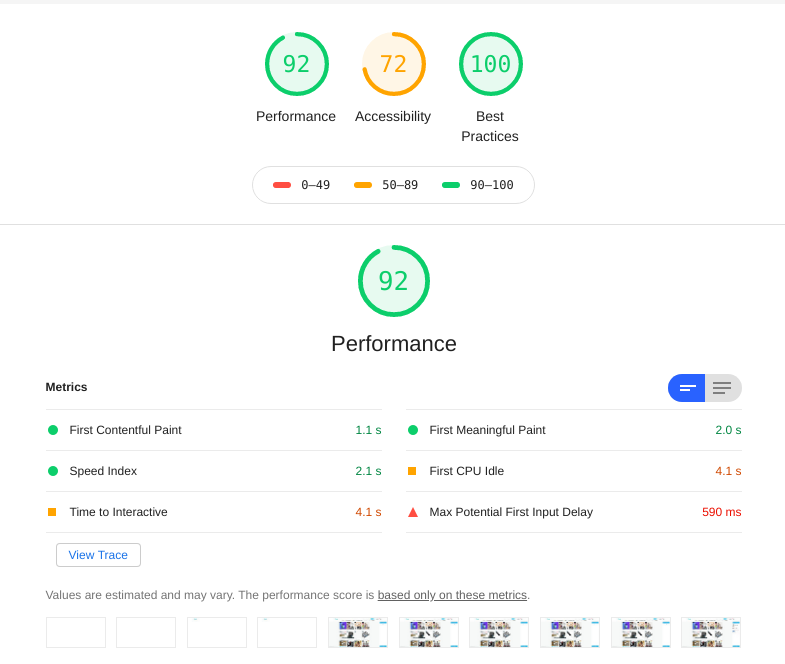
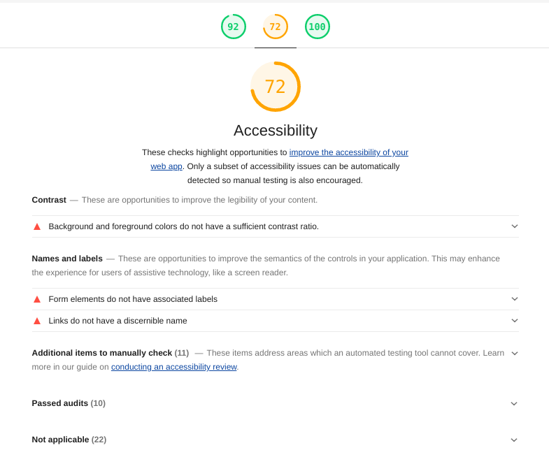
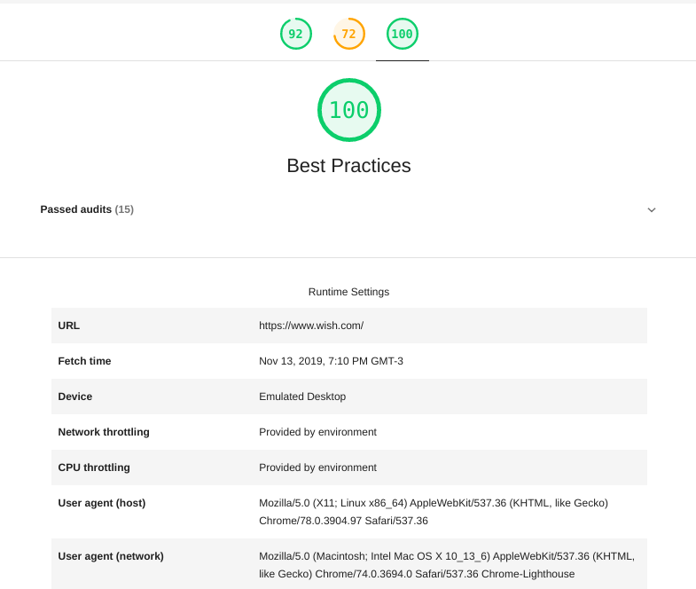
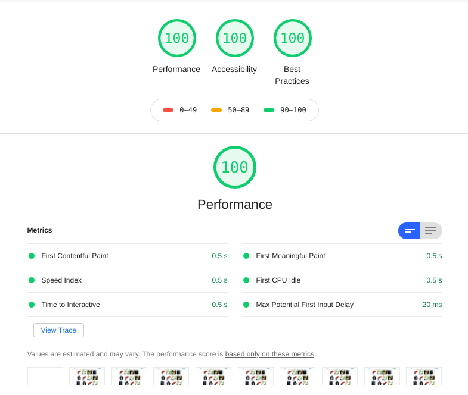
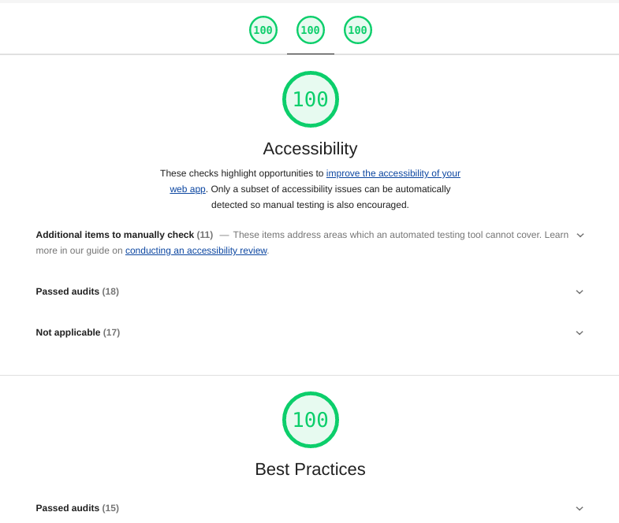
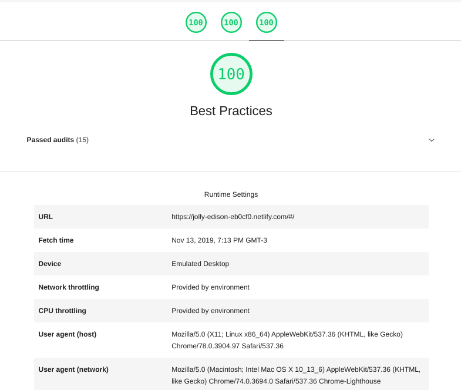

## Análise

O Google Lighthouse é uma ferramenta de análise e audotoria de sites, que verifica performance, boas práticas, questões de acessibilidade dentre outros. O grupo optou por usá-lo justamente por isso, e fazer uma comparação com o site atual do Wish para ver se o nosso protótipo possui ou não melhorias de fato.

Mais informações sobre o lighthouse podem ser vistas nesse [link](https://developers.google.com/web/tools/lighthouse/?hl=pt-br)

### Site atual - Wish

Apesar de bem pontuado, vemos que o site não possui 100 pontos em performance, e é ainda pior em acessibilidade. Fatores como contraste entre plano de fundo e plano de frente, links com nomes discerníveis e elementos forms com uma label são ignorados.

### Protótipo

Como o grupo buscou aperfeiçoar alguns erros do wish, vemos que a pontuação é máxima. Houve cuidado na preocupação de colocar legendas nas imagens, verificar o contraste entre as cores dentre outros fatores, além do próprio fator usabilidade que pode ser visto no protótipo.