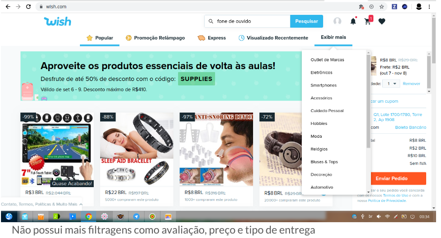

## Introdução

As metas de usabilidade, foram definidas seguindo os níveis definidos por Jakob Nielsen:

- Eficácia
- Eficiência
- Segurança
- Utilidade
- Aprendizagem
- Memorização

Para cada nível de Usabilidade, foram levantados os seguintes questionamentos chaves, baseados em um artigo [1]:

- __Eficácia__
    - O sistema serve ao propósito principal?
- __Eficiência__
    - Quantos recursos são utilizados para realizar a tarefa específica?
- __Segurança__
    - O sistema previne o usuário de erros ou ações indesejáveis? O sistema recupera as ações anteriores?
- __Utilidade__
    - O sistema oferece ao usuário a funcionalidade certa segundo o contexto?
- __Aprendizagem__
    - É fácil aprender a usar?
- __Memorização__
    - Que tipo de suporte é oferecido ao usuário para auxiliá-lo na realização das tarefas, especialmente os itens não recorrentes?

Com as respostas das perguntas baseada nas heurísticas levantadas, foram levantadas as seguintes metas para o sistema, pautadas em seus defeitos:

__Eficiência__: Reduzir o tempo de compra de 33.0 segundos, para 19.0 segundos, tempo levado para realizar uma compra dentro do site da Amazon.

__Segurança__: Aumentar o destaque dos botões de cancelar. Melhorar o sistema de filtragem de produtos, para o usuário não se confundir em sua busca.

__Utilidade__: Oferecer mais opções de filtro de produtos na página principal. Oferecer a opção de traduzir as informações em outra língua de produtos.

__Eficácia__: acrescentar mais informações principais do produto, como o nome e avaliação da loja.

__Aprendizagem__: O site apresenta uma visão bem minimalista, com passos de compra bem intuitivo e localização de ferramentas de busca, perfil e carrinho de fácil acesso para quem utiliza o site pela primeira vez.

__Memorização__: Caso não ocorra uma mudança brusca de design o site continua sendo bem intuitivo para compra e de fácil memorização em caso de utilização do site tempos depois.

## Referências

[1] https://medium.com/vivareal-ux-chapter/as-6-metas-de-usabilidade-9491442fd56a