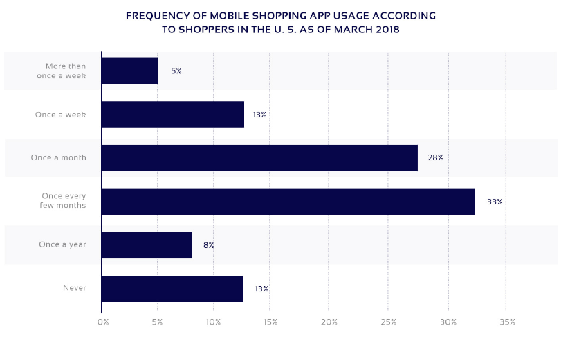

## Introdução

Para podermos fazer a análise do usuário, é interessante fazer uma análise de diversos outros dados e fatores que nos permitem abordar e categorizar os usuários da plataforma. Com isso em mente, o grupo fez uma pesquisa a fim de obter dados como "o que mais se compra no __Wish__", "quais países mais usam a plataforma", dentre outros aspectos.

### Sobre o Wish

1 - Atualmente, 500 milhões de usuários estão ativos no aplicativo Wish.

2 - Existem mais de 1 milhão de comerciantes Wish.

3 - O aplicativo Wish marketplace registrou uma receita de US $ 1,9 bilhão em 2018, enquanto foi de apenas US $ 1 bilhão em 2017.

4 - A avaliação relatada do __Wish__ é de US $ 8,7 bilhões.

5 - O Wish gasta US $ 100 milhões anualmente em anúncios no Facebook.

6 - O financiamento relatado do Wish é de US $ 1,25 bilhão. 

### Foco no Mobile

Uma pesquisa do PEW Research Center via Coresight Research mostrou que 21% dos compradores de baixa renda acessam a Internet apenas em seus smartphones, o que é superior à média de 12%. A atenção à experiência de compra móvel levou ao uso em larga escala do Wish nos Estados Unidos e em todo o mundo, e seus rankings ainda refletem esse fato. [1]

As versões Android e Ios do Wish permanecem regularmente em primeiro lugar em todos os aplicativos de compras, superando a __Amazon__, o __eBay__, etc. Isso se deve em grande parte à maneira como o Wish posicionou seu aplicativo, concentrando-se na __experiência de navegação__ em oposição à __experiência de compra__. Os usuários do aplicativo podem abrir o aplicativo Wish, gastar cinco minutos procurando ofertas que possam interessá-lo e continuar o dia. Parece mais um site de ofertas diárias de criação de hábitos, como o Groupon ou o Woot (de propriedade da Amazon), do que uma loja de comércio eletrônico tradicional. Isso é bem diferente da experiência do aplicativo Amazon, onde a pesquisa de itens específicos é enfatizada. [1]

Tais fatos se confirmam ainda mais ao vermos as imagens acima, que demonstram o crescimento da utilização de celulares para navegação e compras onlines, e o vertiginoso crescimento da Wish.

### Diversidade de produtos e alcance global

O Wish já possui mais de __20 milhões__ de clientes residentes no __Reino Unido__ e oferece acesso fácil a um total de mais de __100 milhões__ de clientes __em toda a Europa__ e a um total de mais de __200 milhões de clientes em mais de 70 países diferentes do mundo__.

Metade dos nossos clientes tem menos de 30 anos, o que representa uma demografia muito diferente de outros mercados. Há também um forte viés feminino - no entanto, isso está se alterando rapidamente de acordo com as taxas de adoção de smartphones. [2]

Os consumidores são realmente diversos e compram em uma ampla variedade de categorias. Nos EUA, por exemplo, os vendedores mais bem-sucedidos geram milhões em receita anual de categorias que incluem utensílios domésticos, tecnologia recondicionada e equipamentos externos.

#### Principais Oportunidades
Cuidados pessoais, Brinquedos e jogos, Casa e jardim, Eletricidade de valor, Adulto, Fragrâncias dentre outros

#### Produtos não muito interessantes
Marcas de luxo, produtos altamente específicos (por exemplo, peças de automóveis BMV), serviços digitais.

## Perfil de usuário

A partir de todos os dados acima, podemos traçar um perfil do usuário do site __Wish__:

| **Item ** | **Descrição**  |
|--|--|
|__Idade:__ | Com __idade média máxima de 30 anos__.  |
|__Sexo:__ | __Maioria feminina__, mas os dados indicam que está havendo um balanceamento aqui |
|__Experiência com tecnologia:__ | Visto que a grande maioria dos acessos é feita via celular, há uma experiência __pelo menos média__. |
|__Produtos que procura:__ | Principalmente produtos de beleza, mas há diversos segmentos de produtos sendo procurados dentro do __Wish__ |
|__Meio que acessa o site:__ | Principalmente por meio do __celular__  |
|__Origem do usuário:__ | Em maioria européia, mas há usuários __diversos países do globo__. |
|__Gasto médio:__ | Os usuários do Wish costumam procurar produtos de valores baixos, então o gasto médio dentro da aplicação costuma ser __baixo__.|

## Referências 

[1] https://jilt.com/blog/wish-growth/

[2] https://tamebay.com/2017/09/meet-marketplace-wish.html

[3] https://blog.bigziel.com/build-marketplace-app-like-wish/

[4] https://light-it.net/blog/how-to-make-an-app-like-wish-or-even-better/