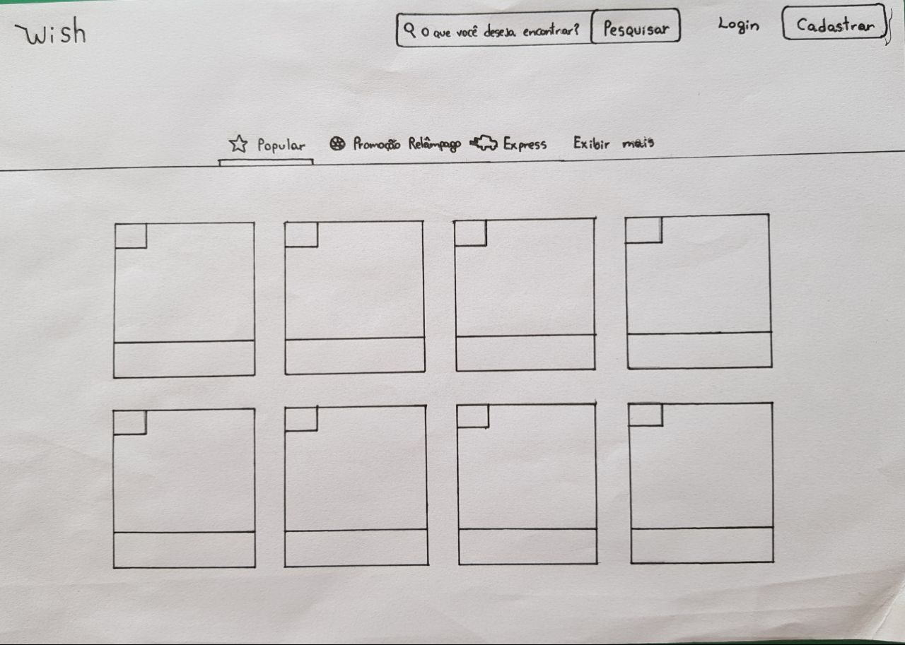
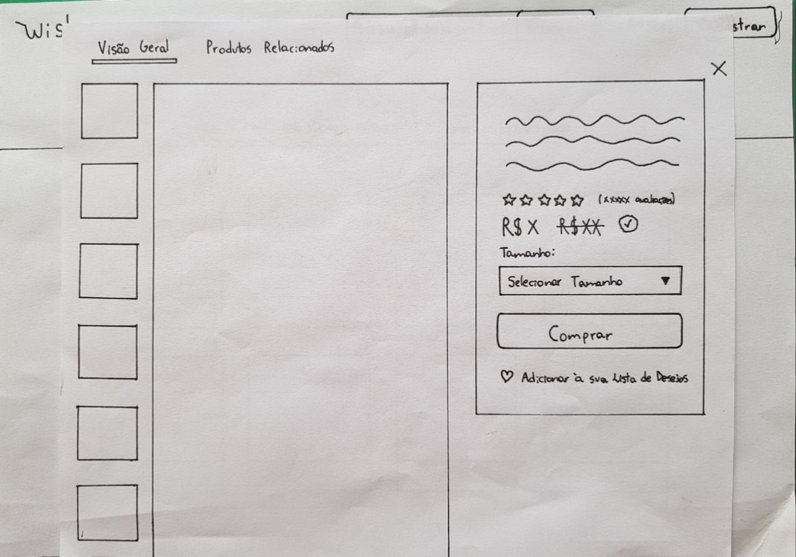
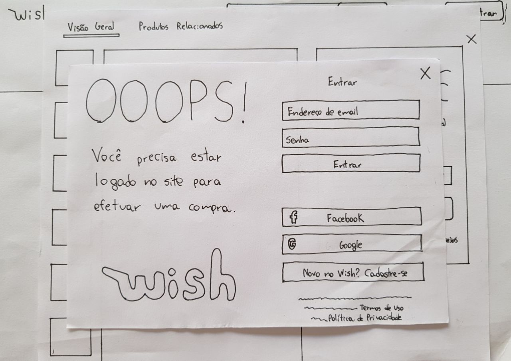

## Descrição

Prototipagem de papel é uma técnica que permite criar e testar interfaces de usuário de forma rápida e barata em que os protótipos, de papel, geram um excelente feedback de observação sobre o comportamento do usuário em relação ao design.

Nosso Protótipo busca demonstrar o fluxo de compra de um produto sem que haja a necessidade da realização de um login ou cadastro até que a compra seja iniciada.

