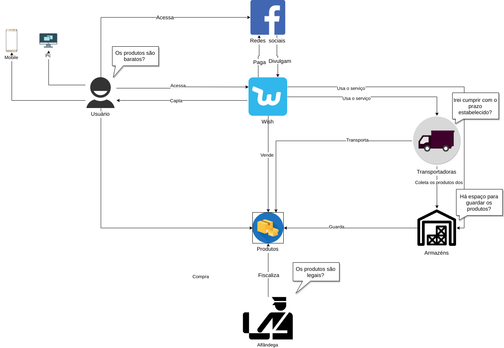

## **Introdução**

Os RichPictures são artefatos usados na fase de pré-rastreabilidade de Requisitos de Software, são desenhos que expressam ideias que ajudam na representação de subsistemas de um sistema maior. Neste trabalho, os RichPictures foram feitos em cima de pontos relevantes para o levantamento de requisitos do aplicativo Guiabolso.

## **Metodologia**

Para a confecção dos richpictures o grupo utilizou a ferramenta [Draw IO](https://www.draw.io/). Utilizamos cards com o seguinte modelo base:

| **RPXX** | **Título do richpicture**  |
|--|--|
| **Versão**| Atual: 1.0 (Data)   Anterior: - | 
| **Descrição** | Descrição do richpicture | 
|**Autor**| Autor | 

Além disso todos os richpicures devem ter seu tema principal no centro da imagem. 

## RP01 - Macro

| **RP01** | **Macros**  |
|--|--|
| **Versão**| Atual: 1.0   Anterior: - | 
| **Descrição** | Este RichPicture ilustra como de entender o funcionamento do aplicativo e as principais interações do usuário com o sistema como um todo. |
|**Autor**| Elias Bernardo | 
