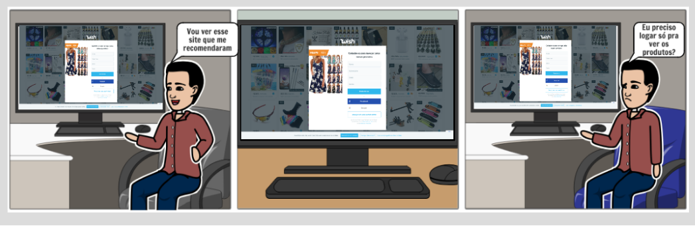
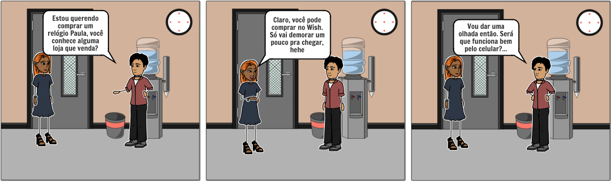

# Storyboard

## Storboard 1

Frustração do usuário ao perceber que é obrigado a fazer login para poder ver os produtos

#### Requisitos elicitados & MoSCoW

| Código | Descrição | Prioridade |
|--|--|--|
| SB01 |  Exibir produtos mesmo com usuários não cadastrados | Could have |
| SB02 |  Facilitar o acesso para terceiros | Would have |
| SB03 |  Exibir a lista de produtos de maneira objetiva | Would have |

## Storyboard 2

Um usuário conhecendo o Wish por meio da recomendação de um colega de trabalho

#### Requisitos elicitados & MoSCoW

| Código | Descrição | Prioridade |
|--|--|--|
| SB04 |  Tornar o sistema responsivo | Could have |
| SB05 |  Permitir que uma compra iniciada pelo celular seja finalizada pelo computador e vice-versa | Should have |